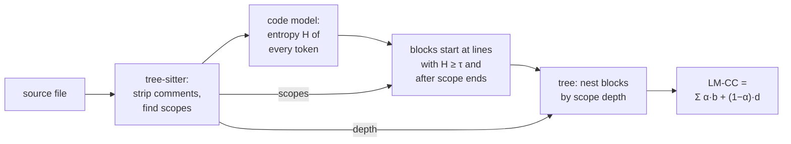
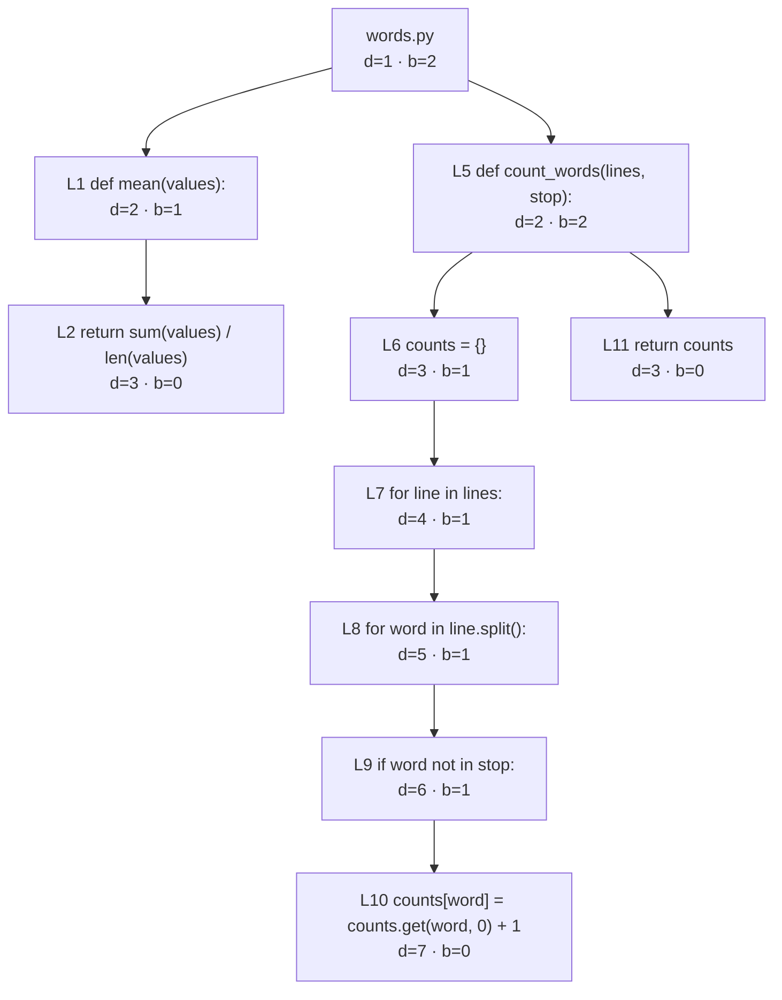

# llm-cc

[](https://github.com/pawelchcki/llm-cc/releases/latest)
[](LICENSE)

`llm-cc` finds the code that is hardest for a language model to read. It runs
a code model locally through llama.cpp, measures how unsure the model is before
each token, and turns that into **LM-CC**, the complexity metric from
*Rethinking Code Complexity Through the Lens of Large Language Models* (Xie,
Gu, Shi, Shen; [arXiv:2602.07882](https://arxiv.org/abs/2602.07882)). You get
scores for files and functions, the lines where the model struggled most, and
a before/after report for a branch. Code a model stumbles on is code that LLM
tools, and often people, get wrong.

Cyclomatic complexity counts branches; LM-CC measures where a model has to
guess. In the paper, groups of programs with higher LM-CC were solved less
often by an LLM at program repair, translation and execution reasoning, even at
equal length (partial correlations as strong as −0.97). Rewriting programs to
lower LM-CC, with cyclomatic complexity unchanged, raised the repair success
rate from 13.4% to 16.2% and translation from 42.2% to 46.5%.

Languages: Rust, C, C++ (and CUDA), Java, Python, Go, JavaScript (Node.js, not
JSX or TypeScript) and C#. Platforms: Linux x86-64 (CPU, CUDA, ROCm), Linux
ARM64 (CPU), macOS (Metal) and Windows x64 (CPU). Expect to download a model:
the default is about 14 GB and wants a GPU; CPU works with a smaller one.

## Quick start

```sh
sh -c "$(curl -fsSL https://github.com/pawelchcki/llm-cc/releases/latest/download/install.sh || echo exit 1)"
```

The installer picks your platform, verifies SHA-256, puts `llm-cc` in
`~/.local/bin`, and on Linux x86-64 adds the CUDA or ROCm backend when it
detects that GPU. On Windows, run `py -3 install_release.py` from a
[release](https://github.com/pawelchcki/llm-cc/releases). To build from source
with [Bazelisk](https://github.com/bazelbuild/bazelisk):
`bazel run --config=release --config=cpu //:install` (or `metal`, `cuda`,
`rocm`). [USAGE.md](USAGE.md#installation) has every option.

```sh
llm-cc src --format text                                                    # GPU
llm-cc src --force-cpu --model-name qwen2.5-coder-3b-q6_k -y --format text  # CPU
```

llm-cc asks before downloading a model; `-y` accepts. The default,
DeepSeek-Coder-V2-Lite-Base Q6_K, runs on the GPU; without one, llm-cc stops and
prints the same command with `--force-cpu`. CPU inference is slow, so for a
whole project pick a smaller model from `llm-cc models list --available`.

Given `words.py`:

```python
def mean(values):
    return sum(values) / len(values)


def count_words(lines, stop):
    counts = {}
    for line in lines:
        for word in line.split():
            if word not in stop:
                counts[word] = counts.get(word, 0) + 1
    return counts
```

the default model reports (a real CPU run; path shortened):

```console
$ llm-cc words.py --force-cpu --hotspots 3 --format text
/home/you/words.py   score 14.4 (LM-CC)   density 0.354   mean 0.839   tokens 82
  fn mean               L1-L2   2.8
  fn count_words        L5-L11   11.8
  hotspots:
    L1  H=6.854  | def mean(values):
    L5  H=5.949  | def count_words(lines, stop):
    L6  H=3.500  |     counts = {}

totals   score 14.4 (LM-CC)   files 1/1   tokens 82   mean/file 14.4
```

`score` is the file's LM-CC. Each `fn` line scores that function's blocks as a
tree of their own, so function scores don't add up to the file's. Hotspots are
the lines where the model was least sure; definitions often lead because a new
name is hard to predict. `density` and `mean` summarize the same uncertainty
(see [How LM-CC works](#how-lm-cc-works)). Without `--format text` the output
is JSONL for tools; see [USAGE.md](USAGE.md#usage) for its events and exit
codes.

## Compare a branch

```sh
llm-cc compare run --target main --output-dir out
```

This scores `HEAD` and its merge base with `main` and writes `report.md` to
`out/`: totals per category (runtime, tests, tooling), changed files with base
and head LM-CC, and the largest regressions and improvements. Results are
cached by Git blob, language, scorer, model and settings, so a rerun scores
only what changed. In CI the same stages produce the pull-request comment; see
the [comparison pipeline](tools/comparison/README.md). Which files count, and
in which category, comes from
[`.llm-cc/rules.json`](USAGE.md#selection-and-classification-rules).

## How LM-CC works

Where the next token is predictable, a model reads code easily. Where many
continuations look plausible, it has to decide. LM-CC cuts code into blocks at
those decision points, arranges the blocks into a tree, and scores the tree's
breadth and depth.



1. **Entropy.** With comments removed, the model reads the file one token at a
   time. Before each token it predicts a distribution p over its whole
   vocabulary; the entropy H = −Σ p·ln p, in nats, is high when many
   continuations look plausible.
2. **Blocks.** A block starts at the beginning of every line with a token whose
   H ≥ τ. The paper uses τ = 0.67 for CodeLlama-7b; llm-cc calibrates each
   registered model's τ to the same entropy percentile on the paper's
   HumanEval programs (0.586 for the default model). A block also starts right
   after a function, loop, conditional or other scope ends. `density` in the
   output is the share of tokens with H ≥ τ, and `mean` is the mean H.
3. **Tree.** The file is the root, at level d = 1. Each block takes its nesting
   depth from the syntax scopes around it and becomes a child of the closest
   earlier block that is less deeply nested, or of the root.
4. **Score.** With b(v) the number of children of node v and d(v) its level,
   LM-CC = Σᵥ [α·b(v) + (1 − α)·d(v)], with α = 0.8. Decisions side by side
   raise b; decisions buried in nested scopes raise d.

In `words.py`, every non-blank line from 1 to 10 has a token with H ≥ 0.586,
so each starts a block. Line 11 has none but starts one because the loops end
just before it. A `for` or `if` line already counts as inside the scope it
opens, so each one nests under the line before it and lines 6 to 10 form a
chain:



Σb = 9 and Σd = 36, so LM-CC = 0.8·9 + 0.2·36 = **14.4**, the score above. The
nested chain from line 6 to line 10 alone contributes 25 of the 36 levels.

llm-cc matches the authors' reference code for entropy and the formula, but
its defaults add scope-end boundaries, tree-sitter nesting for every language,
per-model τ and a different model. `--hierarchy reference --model-name
codellama-7b-q8_0` comes closest to the paper's setup; see
[the differences](USAGE.md#relation-to-the-reference-implementation).

## Reading the score

The headline is raw LM-CC, as in the paper, so it grows with file length.
Compare revisions only with the same model and settings. `--score lmcc`
divides by token count, a heuristic the paper does not validate. Treat high
scores as places to look, not verdicts: a lower number alone does not prove a
change made the code better.

## More

- [USAGE.md](USAGE.md): installation, every analysis option, GPU and memory
  settings, long files, repository rules, comparisons.
- [DESIGN.md](DESIGN.md): internals.
- [Comparison pipeline](tools/comparison/README.md) and its
  [CI recipe](tools/comparison/CI_RECIPE.md) for GitHub Actions and GitLab.
- [Using llm-cc from another Bazel module](examples/consumer/README.md).
- [Experiments](experiments): [τ calibration](experiments/tau-calibration/README.md),
  [model selection](experiments/model-selection/README.md) and more.
- [CHANGELOG.md](CHANGELOG.md).

## Development

```sh
bazel test //:unit //:integration
tools/check_format.sh
tools/run_clang_tidy.sh
```

Pull requests run BuildBuddy's CPU, GPU backend and comparison checks. Label a
PR `ci: release-builds` to also run the Linux, macOS (arm64) and Windows
platform builds and consumer installs that otherwise run only on `main` and
release PRs.
