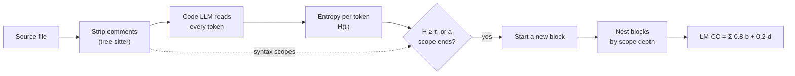
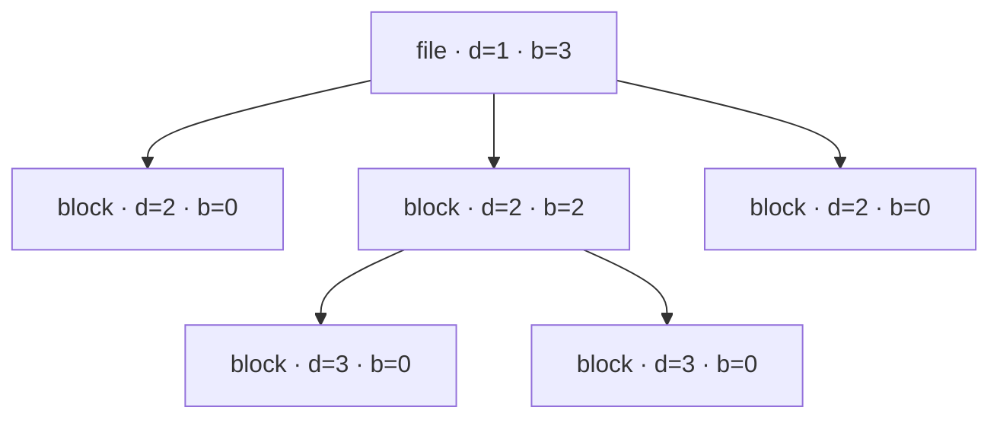

# llm-cc

`llm-cc` scores source code with **LM-CC**, a complexity metric that asks
where a code language model is *unsure* rather than counting control-flow
paths. It runs a local GGUF model through llama.cpp and reports the files,
functions and lines that are hardest for a model to read. That makes them
good candidates for refactoring.

It supports Rust, C, C++ (and CUDA), Java, Python, Go, Node.js JavaScript and
C#, on Linux (x86-64, ARM64), macOS (Metal) and Windows, with CUDA and ROCm
backends on Linux x86-64.

## Install

```sh
sh -c "$(curl -fsSL https://github.com/pawelchcki/llm-cc/releases/latest/download/install.sh || echo exit 1)"
```

The installer picks your platform, checks SHA-256, puts `llm-cc` in
`~/.local/bin`, and fetches the CUDA or ROCm bundle if it finds that GPU. On
Windows, run `py -3 install_release.py` from a
[release](https://github.com/pawelchcki/llm-cc/releases). To build from
source with [Bazelisk](https://github.com/bazelbuild/bazelisk), run
`bazel run --config=release --config=cpu //:install`, using `metal`, `cuda` or
`rocm` in place of `cpu` as needed. See [USAGE.md](USAGE.md#installation) for
every option.

## Use

```sh
llm-cc src --format text                            # files, functions, hotspots
llm-cc src --force-cpu --model-name qwen2.5-coder-3b-q6_k -y --format text
llm-cc compare run --target main --output-dir out   # how this branch changes LM-CC
llm-cc rules show                                   # which files count, and as what
```

The default model, DeepSeek-Coder-V2-Lite Q6_K, is about 14 GB and downloads
after you confirm. Run `llm-cc models list --available` to see smaller ones.
Without `--format text`, output is JSONL for tools. [USAGE.md](USAGE.md)
covers GPU and memory settings, long files, repository rules, and the exit
code contract.

## How LM-CC works

LM-CC comes from *Rethinking Code Complexity Through the Lens of Large
Language Models* (Xie, Shi, Gu, Shen; [arXiv:2602.07882](https://arxiv.org/abs/2602.07882)).
Its premise: a model reads code easily where each next token is predictable,
and struggles at the points where it has to decide what comes next. LM-CC
turns those decision points into a tree and measures the tree's breadth and
depth.



1. **Measure uncertainty.** With comments removed, the model reads the file
   one token at a time. At each position the entropy of its full next-token
   distribution, H(tᵢ) = −Σⱼ p(tⱼ | t<ᵢ) log p(tⱼ | t<ᵢ), says how unsure it
   was.
2. **Cut blocks.** A new block starts on a line where entropy reaches the
   threshold τ, or where a loop, conditional or function ends. The paper uses
   τ = 0.67 nats for CodeLlama-7b. llm-cc gives each model its own τ that
   marks the same share of tokens.
3. **Build a tree.** The whole file is the root, at level d = 1. Each block
   takes its nesting depth from the syntax and becomes a child of the closest
   earlier block that is less deeply nested.
4. **Score it.** For every node v, let b(v) be its number of children and
   d(v) its level. Then LM-CC = Σᵥ α·b(v) + (1 − α)·d(v), with α = 0.8.

An example tree, where `d` is the level and `b` the number of children:



Here Σb = 5 and Σd = 13, so LM-CC = 0.8·5 + 0.2·13 = **6.6**. Many decision
points side by side raise b; decision points buried in nested scopes raise d.

In the paper, after controlling for code length, LM-CC's partial correlation
with LLM pass@1 reaches −0.93 on program repair, −0.97 on translation and −0.92
on execution reasoning. Rewriting programs to lower LM-CC, while keeping their
cyclomatic complexity the same, raised repair pass@1 from 13.4% to 16.2%.

llm-cc follows the authors' reference code for entropy and the formula.
Its defaults depart from that code in a few ways:

- scope ends are boundaries too, where the reference uses entropy alone;
- tree-sitter supplies nesting in every language, not Python indentation;
- comments are removed without reformatting;
- τ is set per model;
- the model is DeepSeek-Coder-V2-Lite, not CodeLlama-7b.

`--hierarchy reference` uses entropy boundaries only, and the registered
`codellama-7b-q8_0` model matches the paper's model choice. See
[USAGE.md](USAGE.md#relation-to-the-reference-implementation).

## Reading the score

The headline is raw LM-CC, as in the paper, so it grows with file length.
Compare revisions only with the same model and settings. `--score lmcc` divides
by token count, a heuristic the paper does not validate. Treat high scores as
places to look, not as verdicts: a lower number alone does not prove a change
made the code better.

## Development

```sh
bazel test //:unit //:integration
tools/run_clang_tidy.sh
```

Pull requests run BuildBuddy's CPU, GPU backend and LM-CC comparison checks.
The full release matrix covers Linux x86-64 and ARM64, macOS, Windows, and
the CPU and CUDA consumer installs. It runs on `main`, on release-please PRs,
and on any PR labeled `ci: release-builds`.

More: [DESIGN.md](DESIGN.md) (internals),
[comparison pipeline](tools/comparison/README.md) and its
[CI recipe](tools/comparison/CI_RECIPE.md),
[consuming llm-cc from Bazel](examples/consumer/README.md),
[experiments](experiments), [CHANGELOG.md](CHANGELOG.md).
